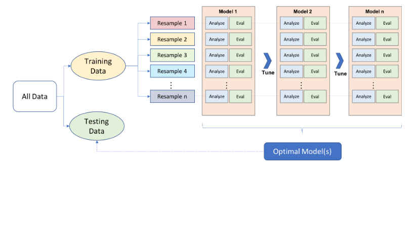
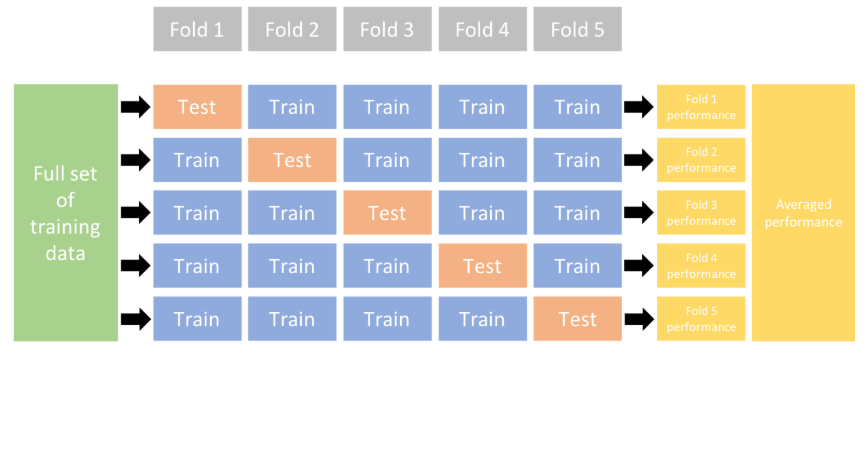
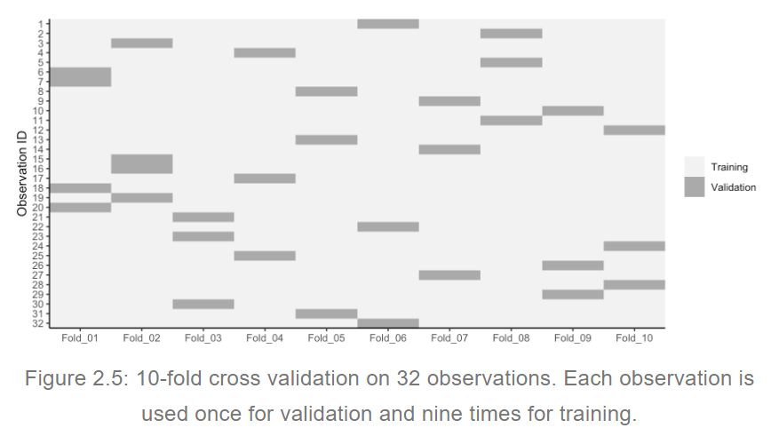
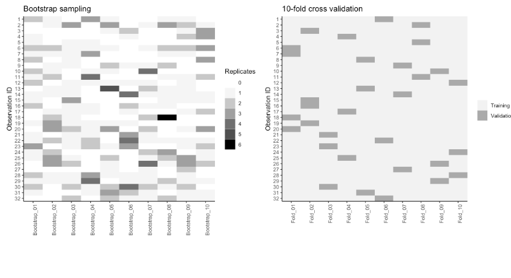

```{r}
library(dplyr)
library(ggplot2)
library(h2o)
library(rsample)
library(AmesHousing)
library(caret)
```

```{r}
# Ejemplo 1
# h2o set-up 
h2o.no_progress()  # turn off h2o progress bars
h2o.init()         # launch h2o
ames <- AmesHousing::make_ames()
ames.h2o <- as.h2o(ames)
## Job attrition data
churn <- rsample::attrition %>% 
          mutate_if(is.ordered, .funs = factor,   
          ordered = FALSE)
churn.h2o <- as.h2o(churn)
```


```{r}
# Ejemplo 2
attrition <- rsample::attrition
```


# Proceso de Machine Learning
* Es un proceso iterativo y heurístico (no ohay garantías de que ótimo pero es suficiente para alcanzar los objetivos a corto plazo)
* No free lunch theorem:  no hay un mejor algoritmo de machine learning que sirva para todos los contextos. Se debe el conocimiento de cada istuación en particular para seleccionar un modelo de machine learning.
* Preprocesamiento de la variable respuesta y de los features.
* Minimizar fuga de datos (data leakeage): es decir que cuanto se procese y arregle los datos de la muestra de entrenamiento no influya información externa a esos datos de entrenamiento. (En cada submuestra debería idealmente haber procesamiento de datos).
* Afinar los hiperparámetros.
* Evalaur el desempeño de los parámetros.



# Partición de datos
Training set: procesamiento de features, entrenamiento de nuestros algoritmos, afinamiento de hiperparámetros,
comaparación de modelos, procesos hasta escogencia de un modelo final.
Conjunto de prueba: habiendo escogido el modelo final, evaluación insesgada del desempeño del modelo. (Generalización del error). Es crucial que no se use el conjunto de test antes de tener un conjunto de datos final para evitar sesgos en la evaluación.
Recomendaciones para hacer esto son 60% - 40%, 70%-30%, 80%-20%. Usar más del 80% puede hace que se obtenga un modelo sobreajustado, usar menos del 60% puede hacer que el proceso de selección de modelos no sea tan riguroso.

# Esquemas de muestreo
* Muestreo aleatorio simple: en este esquema de muestreo todos los individuos tienen la misma probabilidad de ser seleccionados.

```{r}
# Using base R
set.seed(123)  # for reproducibility
index_1 <- sample(1:nrow(ames), round(nrow(ames) * 0.7))
train_1 <- ames[index_1, ]
test_1  <- ames[-index_1, ]

# Using caret package
set.seed(123)  # for reproducibility
index_2 <- createDataPartition(ames$Sale_Price, p = 0.7, 
                               list = FALSE)
train_2 <- ames[index_2, ]
test_2  <- ames[-index_2, ]
```

```{r}
# Using rsample package
library(rsample)
set.seed(123)  # for reproducibility
split_1  <- initial_split(ames, prop = 0.7)
train_3  <- training(split_1)
test_3   <- testing(split_1)
```


```{r}
# Using h2o package
split_2 <- h2o.splitFrame(ames.h2o, ratios = 0.7, 
                          seed = 123)
train_4 <- split_2[[1]]
test_4  <- split_2[[2]]
```

Se puede comparar las distribuciones de la variable Sale Price en el archivo train y test.

```{r}
library(ggplot2)
traintest_1 <- data.frame(Sale_Price = 
        c(train_1$Sale_Price, test_1$Sale_Price),
        categoria = c(rep("train",length(train_1$Sale_Price)),
        rep("test",length(test_1$Sale_Price)))  
        )
ggplot(data = traintest_1, aes(x = Sale_Price,
                               color = categoria)) + 
geom_density()  
```

* Muestreo aleatorio estratificado: cuando hay un fuerte desbalanceamiento en la variable respuesta (por ejemplo la categoría Sí toma el 80% y el No el 20%)
 puede ser muy relevante controlar que en la muestra se mantengan esas proporciones. También cuando se tiene una variable respuesta muy asimétrica, se puede particionar la variable en percentiles. 

```{r}
# Ejemplo 1
quantile_Sale_Price <- quantile(ames$Sale_Price) 
cuartil_Sale_Price <- cut(ames$Sale_Price, breaks = quantile_Sale_Price, include.lowest = T, right = F,
                          labels = 1:4)
ames$cuartil_Sale_Price <- cuartil_Sale_Price
set.seed(123)
split_strat  <- initial_split(ames, prop = 0.7, 
                 strata = "cuartil_Sale_Price")
train_strat  <- training(split_strat)
test_strat   <- testing(split_strat)
```


```{r}
# orginal response distribution
table(churn$Attrition) %>% prop.table()
```

```{r}
# stratified sampling with the rsample package
set.seed(123)
split_strat  <- initial_split(churn, prop = 0.7, 
                              strata = "Attrition")
train_strat  <- training(split_strat)
test_strat   <- testing(split_strat)

# consistent response ratio between train & test
table(train_strat$Attrition) %>% prop.table()

```

# Desbalanceamiento de clases

Usualmente, los problemas de clasificación donde una de las clases es una pequeña proporción de las observaciones (por ejemplo menos del 5% en una clase). Varios métodos de muestreo han sido desarrollados para remediar este problema.  Se pueden clasificar en métodos de submuetreo o métodos de submuestreo.

Métodos de submuetreo: se mantiene toda la muestra de la clase menos común y se seleccionar aleatoriamente un número igual de la clase más abundante.
Esto es viable cuando existe una muy buena cantidad de datos de manera que cuando se balanceen los datos con respecto a la clase menos común aún así hayan suficientes datos para entrenar.

Métodos de sobremuestreo: se incrementa la clase menos común a través de repetir cada uno de los datos con bootstrapping. Existen opciones para reponderar los desbalanceamientos (weighting option en el paquete h2o).


# Validación cruzada k-fold (k partes)

El enfoque de validación divide el conjunto de entrenamiento en un conjunto de de entrenamiento y un conjunto de validación (conjunto de holdout). Un conjunto de validación suele no ser suficidente a no ser que el tamaño del conjunto de entrenamiento sea muy grande, usar sólo un conjunto de validación puede generar estimaciones muy variables.




Al disponer de varios conjuntos de datos se puede estimar el error de generalización al promediar los k errores de prueba brindádonos una aproximación del error que podríamos esperar en datos no obsservados. Un número comunmente usado para k es de 5 o de 10. Diferentes estudios han mostrado que usar 10 clases da resultados muy similares a usar k = n (validación conocida como leave-out out Cross Validation).




Otro método de remuestreo para realizar validación es del bootstrap: Es este método se saca una muestra de tamaño n, los elementos que no aparecen repetidos ninguna vez son usados como muestra de validación, los demás elementos que se repiten al menos una vez son usados como muestra de entrenamiento. Los errores de estimación en cada conjunto de validación tienden a ser menores en un bootstrap comparado con la validación cruzada k-fold pero también tiende a tener mayor sesgo en los errores de estimación.

Bootstrap se usa más tipicamente como parte de los algoritmos de entrenamiento que como método de validación.



# K vecinos más cercanos

